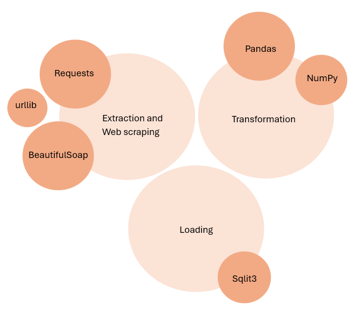

# GDP_Analysis_ETLProject

## Introduction
Analyzed information, using the python libraries, regarding the GPP_in_billions for 214 countries worldwide. Extracted the data using web scraping fromt a wikipedia web page, transformed the data preserving the data integrity via python libraires: numpy and pandas, and then finally dumped the data into the sqlite3. The whole project was refered on the grounds of python-based ETL pipeline. 

## Libraries used:
1- Extraction and webscraping
- BeautifulSoap
- Requests
- urllib
2- Transformation
- Numpy
- Pandas
3- Loading
- Sqlite3

## Process
- The data was extracted using the webscraping techniques leveraged by the python libraries: urllib, requests, and beautiful soap.
- The data was transformed from million_USD to billion_USD, converted to lower case, and the irrelevant white spaces were cleaned, using the python libraries: numpy and pandas.
- The data was loaded into the sqlite3 database, using the python library: sqlite3
- The functions were called for each stage.

## Dataset
[The actual dataset](https://en.wikipedia.org/wiki/List_of_countries_by_GDP_(nominal))

[The final loaded csv dataset](project.csv)

## Scripts used
[Extraction, Transformation, Loading, and the Functions called](finalproject.py)

[The final csv file created for the staging](prject.csv)

[The database created](MyDB.db)

[The logs stored for each function](etl_project_log.txt)
